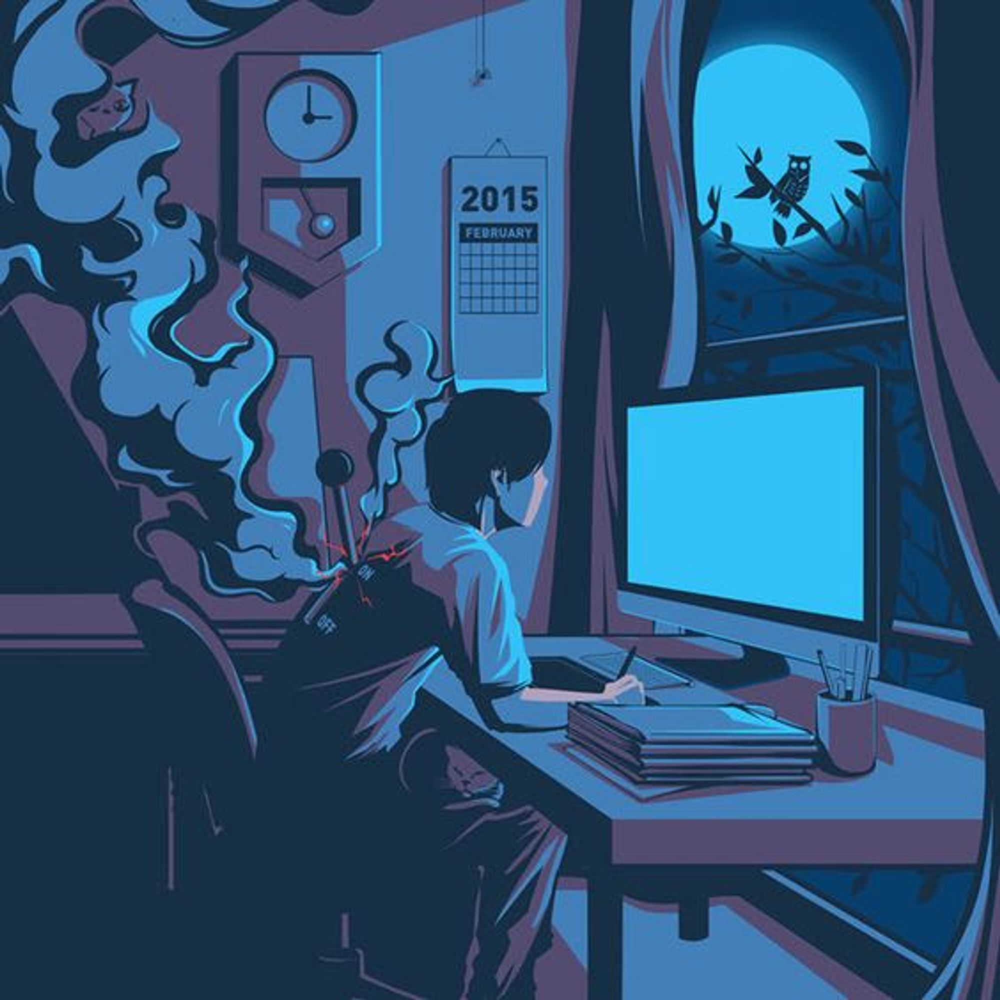

 <h1 align="center">Me chamo Luís Roberto </h1>

 
 <h2 align="center">Sobre mim</h2>
  
Sempre gostei de Tecnologia. Sou apaixonado por programação, design gráfico, píxel art e prototipação de sites, principalmente na parte de front end!

  <li> 👨🏻‍💻 Estudo focado em Front End.</li>
  <li> 🎓 Faculdade em Sistema da Informação (5º Semestre).</li>
  <li> 📚️ Atualmente estudando SASS e JavaScript.</li>

   
   

  ## <h2 align="center">Linguagens e Ferramentas</h2>
  

  <code></code> 
  <code></code>
  <code></code>
  <code></code>
  <code></code>
  <code></code>
  <code></code>
  

  
   
   

  
  Estatísticas GitHub

 

    
    

   
Contagem de visitantes
  
  

 
   

 

<h2 align="center">
  Conecte-se comigo
  
</h2>

 
  <a href="https://www.linkedin.com/in/lu%C3%ADs-roberto-antunes/" target="_blank">
    <code></code>
  </a>
  <a href = "mailto: luisrobertoantunes@gmail.com" target="_blank">
    <code></code>
  </a>

